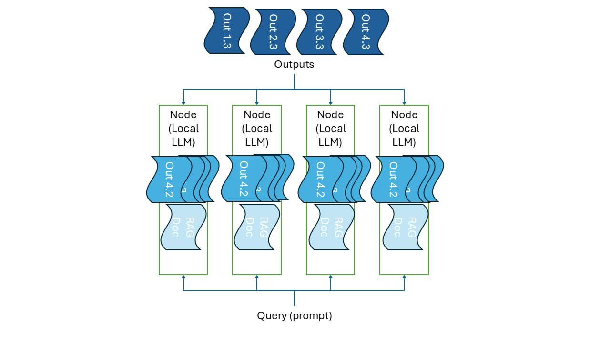

# Dist Model
 سعی بر طراحی یک مدل توزیع شده که بدون نیاز به سخت افزارها و منابع حجیم تجمیع شده بتواند به خوبی کار کند داریم یه همین دلیل  یک مدل توزیع شده که توانایی این را دارد از منابع محدود استفاده کرده و صرفا با خلاصه سازی داده ها به کاربران پاسخ دهد را طراحی کردیم.

 ## توضیح فایل های این صفحه
 - distillgpt.ipynb : پیاده سازی قابلیت یادگیری در مفهوم در قالب یک مدل توزیع شده
 - dist_llm.ipynb : پیاده سازی مدل توزیع شده بر پایه ترنسفورمر و اموزش مدل بر روی دیتاست متون شکسپیر با معماری توزیع شده به صورت زیر برای انجام وظیفه پیش بینی کلمه بعدی

 https://www.gutenberg.org/cache/epub/100/pg100.txt 
 
 - RAG.ipynb : پیاده سازی سیستم رگ توزیع شده بر روی داده هایی که با توزیع متفاوت هستند و سپس اعمال خلاصه سازی بر روی داده برای دریافت پاسخ سوالاتی که اشتراکی از توزیع های رگ های متفاوت دارند.

 ‍
 